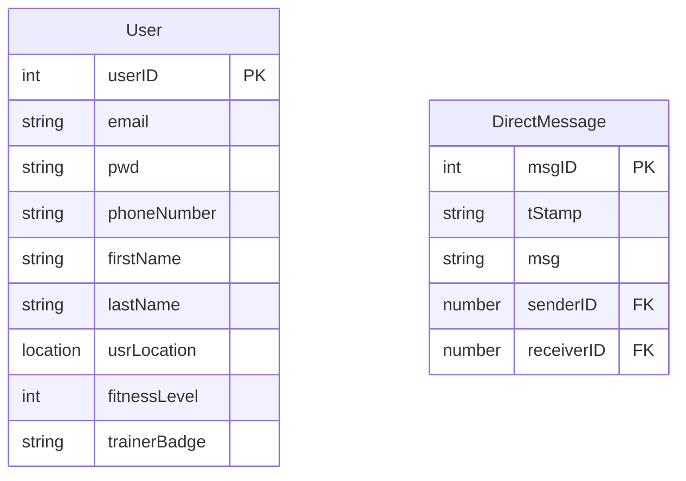

# Spotter: Backend

## Directory Structure

```zsh
.
├── README.md
├── package-lock.json
├── package.json
└── src
    ├── config
    ├── controllers
    ├── data
    ├── middleware
    ├── models
    ├── routes
    ├── services
    ├── utils
    └── server.js
```

> **WARNING**: The 'data' directory is for local db files and is ignored by source control

## Database Architecture


## Database Setup

Initialize the backend if you have not already

```
$ cd backend
$ npm install
```

Create an environment variable file (.env) in the 'backend' directory
```
$ touch .env
```

Add variables to your .env file with a text editor
```text
# Nodejs
NODE_ENV=development

# Database Stuff
LOCAL_DB_PATH=data/local.db
LOCAL_DB_USERNAME=test
LOCAL_DB_PASSWORD=somethingSecure*
```

Run the NPM command to initialize the local sqlite environment

```
$ npm run setup-local-db
```

To reset your local database environment run this NPM command

```
$ npm run clean-local-db
```